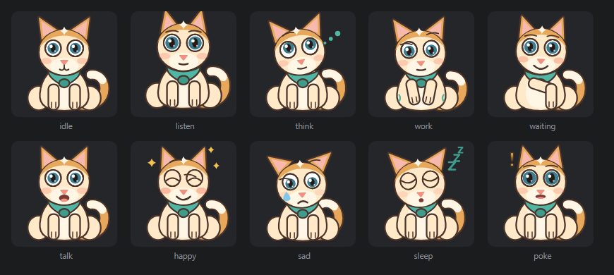

# 布丁桌宠 · Pudding Pet 🐱

> 一只住在 **DeepSeek Harness** 窗口里的猫。它会**朗读助手的回复**、用搞怪的升调复述，
> 可以拖着走，形象还能换成你自己的。

[](LICENSE)
[](LICENSE-ASSETS.md)

<p align="center">
  
</p>

**形象是原创的**：奶油白身体 + 焦糖色头顶斑 + 薄荷绿围巾。
美术以 **CC0** 释出，代码以 **MIT** 释出 —— 可自由使用、修改、分发、商用。
与任何现有商业角色无关，详见[素材授权声明](LICENSE-ASSETS.md)。

---

## 功能

- **朗读助手回复** —— 助手一边写，布丁一边念（监听模型输出的原始流，声音比屏幕上的字还早一点）。
- **朗读你的输入** —— 可选，默认关闭。
- **搞怪变声（两个引擎）** —— 把声音拉成那种欠揍的卡通嗓；可一键关掉变回正常嗓音：
  - **Edge TTS（宿主侧，推荐）** —— 微软 Neural 音色，音质自然；音高偏移可到 **+200Hz** 量级，
    还能再叠加「额外加速」做出花栗鼠效果，**能突破浏览器 2.0 的上限**。
  - **浏览器 speechSynthesis（离线回退）** —— 音高上限 **2.00**（Web 规范写死），
    而且输出无法被捕获，所以花栗鼠那套在它身上做不出来。
  - 默认引擎是 `auto`：优先 Edge，不可用时自动回退浏览器。
- **会朗读给人听的版本** —— 代码块整块丢掉、表格用「，」连、链接只念文字，不会把反引号和星号念出来。
- **可拖动 + 位置记忆** —— 拖到哪儿，下次打开还在哪儿。
- **点击摸头** —— 布丁会缩一下身子。
- **右键设置** —— 音色、变声强度、语速、音量、大小、开关，全部实时生效。
- **10 个状态动画** —— 待机呼吸/眨眼、聆听、思考、干活、等确认、说话、开心、难过、睡觉、被戳。
- **眼珠跟随鼠标** —— 鼠标移动时瞳孔跟着转；悬停时会竖耳。
- **跟随明暗主题** —— 用 DSH 的主题令牌，不用自己适配。
- **形象可替换** —— 视觉层是一个独立接口，换角色不用动语音和交互逻辑。

**零依赖**：不需要 API Key、不调用任何模型、不发起模型请求。
浏览器回退路径完全离线（Web Speech API）；Edge 引擎需要联网，
但它直连的只有微软的公开朗读端点 —— 没有中间服务、没有账号。

---

## 安装

### 从本地目录安装（推荐）

```sh
git clone https://github.com/zbzbhs/dsh-pudding-pet.git
dsh plugin --profile <你的profile> add ./dsh-pudding-pet
```

`<你的profile>` 通常是 `desktop`（桌面版）或 `web`。当前 profile 名可以在 DSH 里看到，
或读环境变量 `DSH_PROFILE`。

装完**需要重启 DSH** —— bundle 的层栈是在启动时组合的。

### 从 GitHub 直接安装

```sh
dsh plugin --profile desktop add github:zbzbhs/dsh-pudding-pet
```

### 装完怎么确认

打开 DSH，布丁应该出现在窗口右下角。右键点它能看到设置面板。
如果没出现，先确认 profile 里有这一条：

```sh
dsh plugin --profile desktop list
```

### 首次出声：可能需要点一下页面

浏览器有自动播放策略 —— 页面还没收到过任何用户手势时，朗读会被拦成 `not-allowed`，
听上去就像「插件坏了」。插件已经做了**首次手势解锁**（第一次点击或按键时就打开音频通道），
真被拦住时布丁会弹一句「先点一下页面，我才能出声哦」，而不是静默失败。
在页面任意位置点一下即可。

---

## 用法

| 操作 | 效果 |
|---|---|
| **按住拖动** | 移动位置（自动记住） |
| **单击** | 摸头，布丁缩一下 |
| **右键** | 打开设置面板 |
| **鼠标在窗口里移动** | 布丁的眼珠跟着你 |
| **鼠标悬停到布丁身上** | 竖耳、睁大眼 |

设置面板里可以调：

- **朗读** —— 助手回复 / 我的输入（两个独立开关）、搞怪变声、音色、变声强度、语速、音量
- **外观** —— 大小、字幕气泡、轻微动作
- **行为** —— 点击反应、重置位置、收起布丁

收起后右下角会出现一个 🐱 按钮，点它把布丁叫回来。

---

## 语音引擎

插件有两个语音引擎，可以在右键设置里选，也可以让它自己挑。

| | **Edge TTS**（宿主侧，推荐） | **浏览器 speechSynthesis** |
|---|---|---|
| 合成在哪里 | 插件宿主进程，请求微软 Edge 朗读端点 | 浏览器内部 |
| 音色 | Neural 音色，明显更自然 | 系统自带语音 |
| 变声能力 | 音高偏移可到 **+200Hz** 量级，再叠加「额外加速」做花栗鼠 | 音高上限 **2.00**（Web 规范写死） |
| 输出能否再加工 | 能 —— 拿到的是 MP3 字节，可以变速变调 | 不能 —— 输出无法被捕获 |
| 需要联网 | **需要** | 不需要，完全离线 |
| 不可用时 | 自动回退浏览器引擎 | —— |

引擎选项：

- **`auto`（默认）** —— 优先 Edge，合成不可用时自动回退浏览器
- **`edge`** —— 只用 Edge
- **`browser`** —— 只用浏览器语音，完全离线

**为什么 Edge 一定要放在宿主侧**：Edge 朗读服务要求请求带上*当前浏览器的 User-Agent*，
而浏览器没法在 WebSocket 上设置这个头 —— 所以只能由宿主发这个请求（宿主可以）。
顺带也解决了浏览器引擎的两个问题：`pitch` 上限 2.0，以及输出拿不到。

**失败不会静默**：宿主合成不可用（没网、端点变更、被拒）时，客户端会收到 `503`，
就地改用浏览器引擎把这段话念完；宿主随后冷却 60 秒再试，而不是每句都重试一遍。

---

## 改代码

```
dsh-pudding-pet/
├── package.json           # 插件清单（dsh.bundle.patch + dsh.client.platform）
├── cordis.patch.yml       # 插入插件行
├── THIRD-PARTY-NOTICES.md # 第三方署名（vendored 文件的上游许可）
├── lib/
│   ├── client.template.js # ★ 浏览器侧源码，改这个
│   ├── client.js          # 构建产物（含烘焙的素材），不要手改
│   ├── index.js           # 宿主侧：两条 TTS 路由（GET-only + 同源围栏）
│   └── edge-tts.js        # vendored Edge TTS 客户端（上游 MIT）
├── assets/
│   ├── pudding.svg        # ★ 形象，美术的唯一事实来源
│   ├── pudding.css        # ★ 10 个状态的动画
│   ├── pudding.js         # 形象控制器（含内联 SVG）
│   └── icon.svg           # 插件管理器图标
├── locale/{zh,en}.json    # 文案
├── tools/build.mjs        # 构建：把素材烘焙进 client.js
└── dev/                   # 本地开发与验证（不参与运行）
```

### 构建

素材必须烘焙进 `lib/client.js`：DSH 通过 `/plugins/<id>/<file>` 投递浏览器代码，
而这个路由**只接受 `client.*.js` 命名的文件**，所以 `assets/` 下的东西在运行时取不到。

```sh
node tools/build.mjs           # 生成 lib/client.js
node tools/build.mjs --check   # 检查产物是否是最新的（CI 用）
```

构建是纯文本替换 + 一次语法校验，产物保持可读。

### 改完之后怎么生效

| 改了哪里 | 生效方式 |
|---|---|
| `lib/client.template.js`、`assets/*` | 跑一次 `node tools/build.mjs`，然后**刷新页面** |
| `lib/index.js`、`lib/edge-tts.js` | **重启 DSH**（宿主侧） |
| `package.json`、`cordis.patch.yml` | **重启 DSH** |

**注意**：读会话事件、Markdown 清洗、排队、渲染、拖动、设置**全部在浏览器侧**完成，
改这些只要刷新页面。宿主侧（`lib/index.js`）现在只做浏览器做不到的那一件事 ——
需要自定义 `User-Agent` 的语音合成，所以改它需要重启。

### 换成你自己的形象

视觉层是 [lib/client.template.js](lib/client.template.js) 里的 `PuddingVisual` 对象，
只要实现这几个方法就能替换：

```js
{
  id: 'my-character',
  label: '我的角色',
  mount: function (host, options) {
    // 往 host 里塞你的 DOM
    return {
      setState: function (name) {},  // idle/listen/think/work/waiting/talk/happy/sad/sleep/poke
      poke: function () {},
      setScale: function (px) {},
      setTalkRate: function (ms) {},  // 可选：说话时嘴巴的开合速度
      freeze: function (on) {},       // 可选：冻结动画
      destroy: function () {}
    };
  }
}
```

语音、拖动、设置、位置记忆都跟形象解耦，**换形象不用动这些**。

---

## 本地开发与验证

`dev/` 和 `tools/` 里是不参与运行的工具。全部检查都是普通 `node` 脚本，
**不需要安装任何依赖**：

```sh
node tools/build.mjs --check        # 构建产物是否最新（改源码忘构建是最常见的错）
node tools/verify-host.mjs          # 宿主契约：无 Config、路由注册、vendored 模块、署名
node tools/inspect-exports.mjs      # client bundle 的导出结构
node dev/test-speech-bridge.mjs     # 朗读桥：文本提取、晚挂载重试、默认静音
node dev/test-client-engine.mjs     # 引擎选择与降级（宿主失败 → 浏览器）
node tools/verify-morph-mechanism.mjs  # 变声机制（重采样算术 + 代码特性检测）
```

需要联网（会真的调用 Edge TTS 合成）：

```sh
node dev/test-host-tts.mjs          # 路由、围栏、缓存、参数钳制、真实合成
```

需要真实 Chromium：

```sh
# 契约测试：跑插件的真实代码（mock 的是 DSH，不是插件）
chrome-headless-shell --headless --disable-gpu --no-sandbox \
  --virtual-time-budget=16000 --dump-dom \
  "file:///<绝对路径>/dev/test-contract.html" > dom.html
node tools/check-contract-result.mjs dom.html
```

`dev/test-contract.html` 用一个最小化的 DSH 替身（模块加载器、两阶段 React、
slots 服务、locale 服务、假的会话事件流）来驱动真实插件代码，覆盖 35 项断言：
挂载、指针事件、`sessions.retain` 调用、朗读触发、Markdown 清洗、销毁清理。

`dev/probe-morph-mechanism.html` 是给**真实浏览器**看的：它验证
`playbackRate` + `preservesPitch = false` 确实改变音高。headless 里跑不了
（没有音频设备，`OfflineAudioContext` 的渲染 promise 在虚拟时间下不结算），
所以仓库里另有一个不依赖音频设备的算术验证（`tools/verify-morph-mechanism.mjs`）。

**验证的边界（如实说明）**：headless 环境下 `requestAnimationFrame` 不触发，
所以**动画的运动过程无法用截图证明** —— 能证明的是静态姿势、状态切换、
样式注入、以及朗读链路正确。动画观感请在真实浏览器里看
`assets/pudding.js` 或上游形象的 `preview.html`。

### 持续集成

[.github/workflows/ci.yml](.github/workflows/ci.yml) 在 `push` 到 `main` 和
每个 `pull_request` 上跑同样的检查。项目零依赖，所以**整个工作流不装任何东西**
（没有 `npm install`），只有 `node` 脚本和一次浏览器。

三个 job：

| job | 跑什么 | 超时 |
|---|---|---|
| `test` | 上面那 5 条离线命令，每条独立一步（`build.mjs --check` 放最前，产物过期是最容易犯的错） | 5 分钟 |
| `contract` | 真实 Chromium 跑 `dev/test-contract.html`，再由 `tools/check-contract-result.mjs` 读 `RESULT:{…}` 并断言 `fail === 0` | 10 分钟 |
| `tts` | `dev/test-host-tts.mjs`，需要联网 | 10 分钟 |

`tts` 是**可选** job（`continue-on-error: true`）：它要打微软的公开朗读端点，
而 CI 的出口 IP 可能被拒 —— 那不能说明插件有问题。所以它失败**不会**让整个 CI 变红，
但日志里会明确写出来。真正的门是 `test` 和 `contract`。

Chromium 由 `browser-actions/setup-chrome@v1` 提供：ubuntu-24.04 上 apt 的
`chromium-browser` 只是个 snap 转发壳，在 runner 上跑不起来。

**`tools/verify-installed.mjs` 不在 CI 里** —— 它校验的是本机 DSH profile 里已安装的副本，
runner 上没有 profile，必然失败。它是给本地用的。

---

## 工作原理

```
        助手输出
           │
           ▼
   agent/assistant-stream          ← 模型输出的原始流，比 DOM 早
           │
           ▼
   sessions.retain(sessionId)      ← 客户端会话控制器，不需要宿主路由
           │
           ▼
   Markdown 清洗                    ← 念"给人听"的版本
           │
           ▼
   逐句队列 ──► 引擎选择（默认 auto：优先 Edge，失败回退浏览器）
           │
     ┌─────┴──────────────────────────────┐
     ▼ Edge 引擎（auto / edge）           ▼ 浏览器引擎（browser / 回退）
   GET /pudding-pet/tts                 Web Speech API
     ?text=…&voice=…&pitch=+50Hz          pitch ≤ 2.00 · 完全离线
           │                                    │
           ▼                                    │
   宿主侧 lib/index.js                         │
     （GET-only + 同源围栏）                     │
           │                                    │
           ▼                                    │
   lib/edge-tts.js                             │
     → 微软 Edge 朗读端点                       │
       （WebSocket + 浏览器 UA）                │
           │                                    │
           ▼                                    │
   MP3 字节 → 客户端 <audio> 播放               │
     再叠加 playbackRate 额外加速（花栗鼠）      │
           │                                    │
           └────────► 布丁张嘴 + 字幕气泡 ◄─────┘
```

**浏览器侧仍然是主体**：读会话事件、Markdown 清洗、排队、渲染、拖动、设置都在浏览器侧 ——
改这些只要刷新页面。宿主侧只补上浏览器做不到的一环：合成必须由能自定义请求头（`User-Agent`）
的进程发出。DSH 的客户端会话控制器已经暴露了读取事件窗口所需的一切
（`sessions.retain` → `eventSource.getSnapshot()/subscribe()`），
所以只有「发声」这一步多了一条宿主路由。
浏览器引擎的回退路径仍然完整保留。

**只念该念的**：只读 `assistant/message` 的 `stream`（可见正文）和
`assistant/chunk` 的文本增量。**推理过程和工具调用参数永远不念。**

---

## 兼容性

- 面向 **DSH Desktop 0.2.0-rc.2**（Electron 44 / Chromium 151）开发与验证。
- DSH 还在快速演进，其他版本**未做通用认证**。
- 浏览器引擎依赖浏览器的 `speechSynthesis`。没有中文语音时会回退到其他语言并提示。
- 浏览器引擎的变声上限是 **2.00** —— 这是 Web Speech API 规范里 `pitch` 的上界。
  Edge 引擎不受这个上限约束。
- Edge 引擎需要网络，并依赖微软的**公开**朗读端点。该端点曾因 User-Agent 收紧而变更，
  若某天失效，插件会自动回退到浏览器引擎 —— 不会静默失声。

---

## 第三方

[`lib/edge-tts.js`](lib/edge-tts.js) 是从上游 MIT 项目 **dsh-tts-reader**
vendored 进来的 Edge TTS 客户端 —— **只加了一个 provenance 头注释，正文逐字节未改**。
宿主侧的语音路由（GET-only、拒绝跨站、同源 `Origin` 校验）的**检查项思路**
参考了 **dsh-speech-plugin**（同为 MIT），**没有复制任何代码**。

上游项目名、URL、版权归属和**完整的 MIT 许可证文本**都记在
[THIRD-PARTY-NOTICES.md](THIRD-PARTY-NOTICES.md)；再分发前请一并保留。

---

## 授权

- **代码**（`lib/`、`tools/`、`dev/`）：**MIT** —— 见 [LICENSE](LICENSE)
- **vendored 代码**（`lib/edge-tts.js`）：按**上游 MIT** 授权 —— 见 [THIRD-PARTY-NOTICES.md](THIRD-PARTY-NOTICES.md)
- **美术**（`assets/` 及布丁形象本身）：**CC0-1.0** —— 见 [LICENSE-ASSETS.md](LICENSE-ASSETS.md)

美术选 CC0 是因为桌宠形象会被内联、截图、改色、做成表情包，
署名义务在这种场景下很难被实际遵守；CC0 让下游零负担。

本项目是个人开源作品，**不是 DeepSeek 官方产品**。
